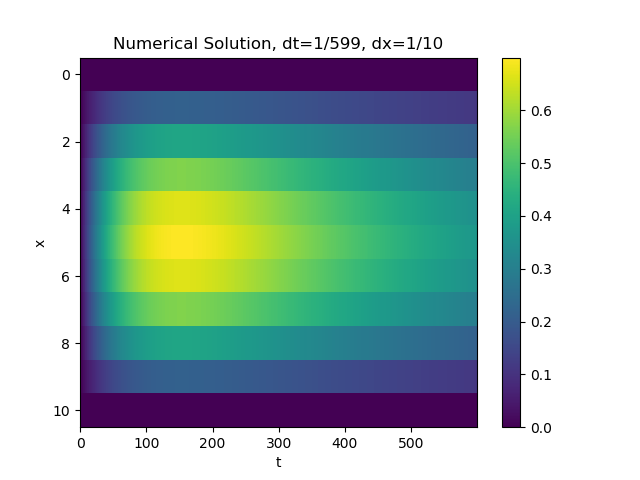

# 1D-Galerkin-Heat-Equation-Solver

Python program to numerically solve the 1 dimensional heat equation using the [Galerkin Finite Element Method](https://en.wikipedia.org/wiki/Galerkin_method) (GFEM).

## Results

